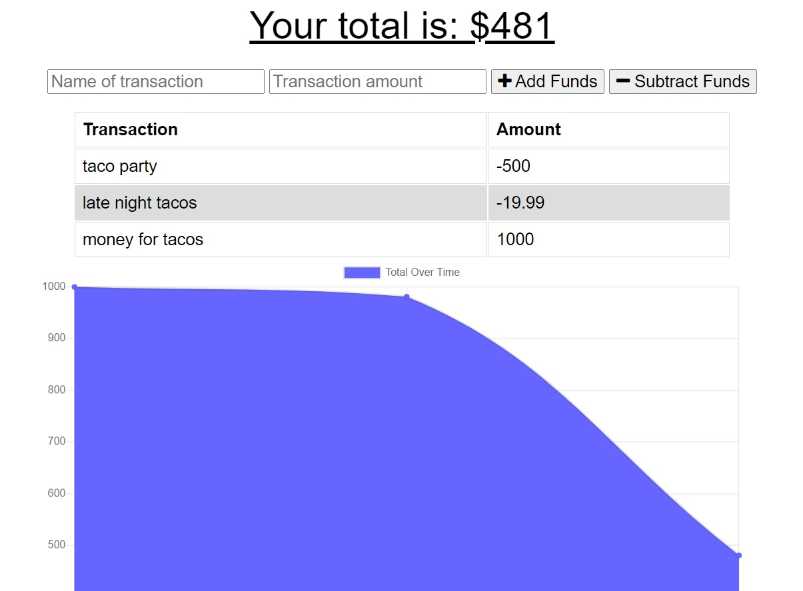

 

  <h1 align="center">Budget Tracker (PWA)</h1>

## Description 

Having trouble tracking your finances?  Bank account always showing zero and wondering where it all went?  Then look no further! With this handy app you can track those pesky finances.  It works offline, it works online, you can even download it to your phone and all for the low low cost of, FREE!

## Table of Contents

* [Usage](#usage)
* [Contributing](#contributing)
* [Tests](#tests)
* [License](#license)
* [Questions](#questions)
* [Links](#links)

## Usage 

- Go [HERE](https://afternoon-falls-07596.herokuapp.com/) to try it out!
- Download to your phone or computer for offline usage.

## Contributing

No contributions at this time please, but your are free to use this app in your own project given the license listed below.

## Tests

I welcome any tests or suggestions to better this project in the future.

## License

This project is covered under the MIT license.

## Questions

I can be contacted via email or on github at:

* E-mail: johntaylorwoodland@gmail.com
* Github: https://github.com/jondagamkd/

## Links

The app can be reached [HERE](https://afternoon-falls-07596.herokuapp.com/), just in case you missed the links above :wink: